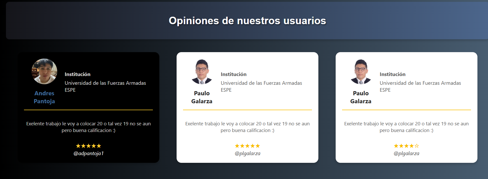
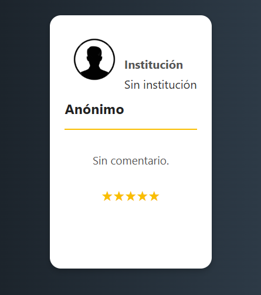
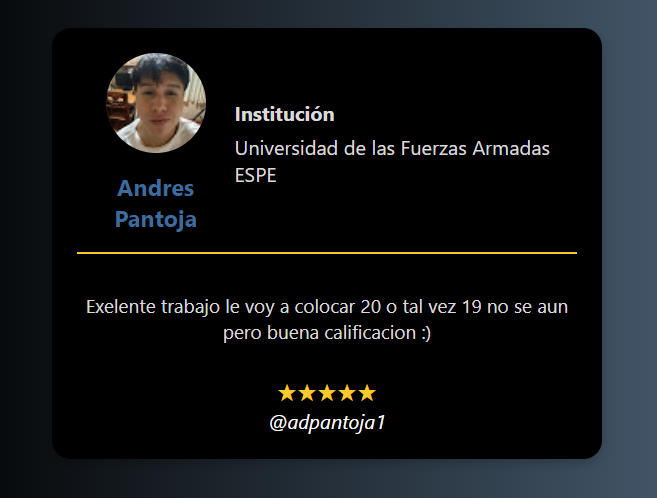

# 🧩 Testimonial Box Web Component

En el examen de la unidad 1 de la sginatura de programación integrativa de componentes me toco realizar un **Web Component personalizado** llamado `<testimonial-box>` que permite mostrar testimonios de usuarios de manera atractiva y reutilizable mediante HTML y JavaScript, usando la tecnología de **Shadow DOM** para encapsular estilos y estructura.

---

## 📌 Explicación del componente

`<testimonial-box>` es un componente diseñado para mostrar reseñas o comentarios de usuarios, incluyendo:

- Imagen del usuario (avatar).
- Nombre del usuario.
- Institución o cargo del usuario.
- Comentario.
- Calificación en estrellas.
- Usuario o firma (cite).

El componente es **reutilizable, estilizable** mediante variables CSS y permite contenido personalizado usando **slots con nombre**.

---

## ⚙️ Atributos personalizados

| Atributo     | Tipo     | Descripción                                                                 |
|--------------|----------|-----------------------------------------------------------------------------|
| `avatar`     | `string` | URL de la imagen del usuario.                                               |
| `coment`     | `string` | Comentario o reseña que el usuario quiere dejar.                            |
| `resenia`    | `number` | Valor entre 1 y 5 para mostrar estrellas.                                   |

---

## 🎨 Variables CSS para personalización

Puedes personalizar el estilo del componente con las siguientes variables CSS:

| Variable              | Descripción                            |
|-----------------------|----------------------------------------|
| `--bg-color`          | Color de fondo de la tarjeta.          |
| `--text-color`        | Color general del texto.               |
| `--name-color`        | Color del nombre del usuario.          |
| `--comment-color`     | Color del comentario.                  |
| `--star-color`        | Color de las estrellas.                |
| `--cite-color`        | Color de la firma (`cite`).            |

---

## 🔧 Slots personalizados

Los siguientes **slots** permiten insertar contenido dentro del componente:

| Slot       | Descripción                           |
|------------|---------------------------------------|
| `name`     | Nombre del usuario.                   |
| `insti`    | Institución o cargo del usuario.      |
| *default*  | Firma o username del autor (`<cite>`) |

---

## 💡 Código de ejemplo

```html
<testimonial-box
  avatar="https://example.com/avatar.png"
  coment="Excelente servicio, muy recomendado"
  resenia="5"
  style="
    --bg-color: #000000;
    --text-color: #ffffff;
    --name-color: #3e6b9c;
    --comment-color: #dbdada;
    --star-color: #faca2d;
    --cite-color: #2f478a;"
>
  <span slot="name">María López</span>
  <span slot="insti">Facultad de Ingeniería</span>
  <cite>@marialopez</cite>
</testimonial-box>
```

---

## 🖼️ Capturas de pantalla

A continuación, una muestra del componente en uso:

#### Vista de ejemplo:

- **Vista general:**
    

- **Componente por defecto:**
    

- **Componente datos completos:**
    

- **Componente con estilos personalizados externos:**
    


---

## 🧪 Cómo usar

1. Incluye el archivo JavaScript:
   ```html
   <script src="testimonial-box.js" defer></script>
   ```

2. Usa el componente dentro de tu HTML como se mostró en el ejemplo anterior.

---

## 📁 Archivos importantes

- `testimonial-box.js` – Define el Web Component.
- `index.html` – Archivo de ejemplo para probar el componente.
- `README.md` – Documentación general.
- `/screenshots/` – Carpeta para las capturas de pantalla.